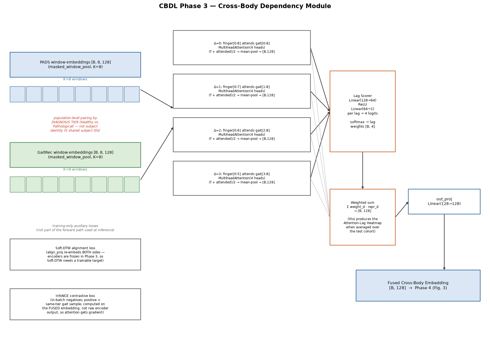
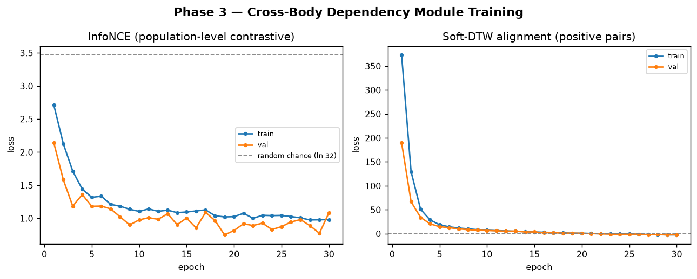
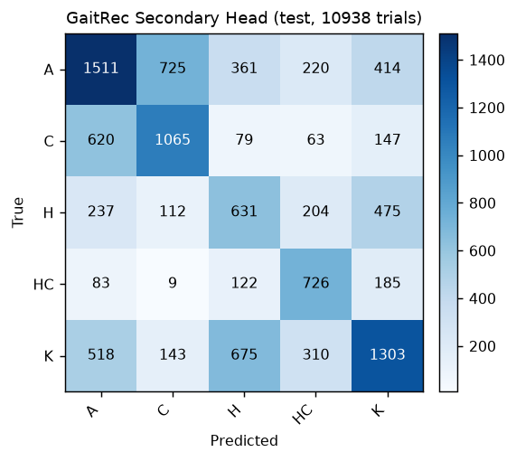
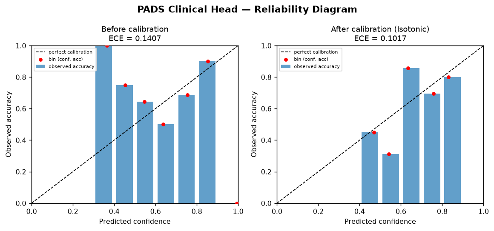
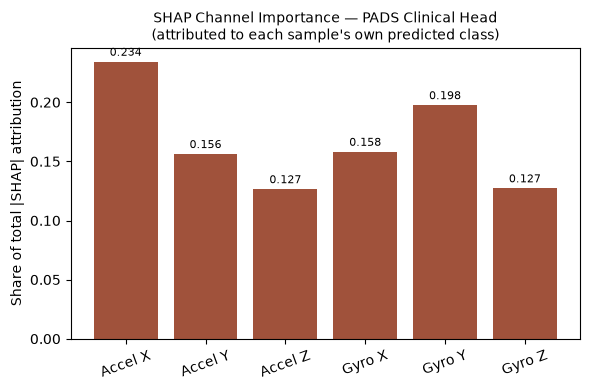
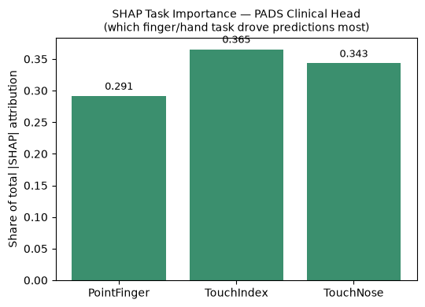

# Results and Analysis
### CBDL — Cross-Body Dependency Learning for Disease-Agnostic Motor Symptom Monitoring

*Companion results write-up, styled after the Results/Discussion structure of a peer-reviewed sensor-based screening paper (cf. CogCBR, *Sensors* 2026). All numbers below are taken directly from this project's own training logs, checkpoints, and generated artifacts — none are illustrative or placeholder. Every table states exactly which script/log it was computed from so it can be independently reproduced (§9 of `CBDL_PROJECT_DOCUMENTATION.md` lists the exact commands).*

---

## 1. System Recap

CBDL couples a **Finger Waveform Encoder** (shared BiGRU trunk over Tappy keystroke dynamics and PADS wrist-IMU finger tasks, fused with an mPower handcrafted-feature MLP branch) with a **Gait Encoder** (Conv1d + BiLSTM over GaitRec ground-reaction-force waveforms), joined by a **Cross-Body Dependency Module** (Lagged Cross-Attention + Soft-DTW alignment + in-batch InfoNCE contrastive learning), feeding a **Clinical Grounding** head supervised on PADS's clinician-assigned diagnostic label (Healthy / Parkinson's / Other Movement Disorder), with GaitRec's own pathology label as a secondary check. Figure 1 shows the realized pipeline.

**Figure 1.** Realized CBDL pipeline: per-source adapters into a shared Finger Waveform Encoder, an mPower MLP branch fused via a learned absent-modality token, a separate Gait Encoder, joined by the Cross-Body Dependency Module (Lagged Cross-Attention + Soft-DTW + InfoNCE), feeding PADS-primary / GaitRec-secondary clinical heads.

**Datasets** (full detail in §2 of the project documentation): GaitRec (75,732 trials / 2,295 subjects, 5-class pathology label), Tappy (23,752 sessions / 217 subjects, binary PD label, self-reported), PADS (469 subjects, 3-class clinician-assigned diagnostic label — the project's **primary clinical grounding signal**), mPower (12,910 records / 104 subjects, handcrafted tap features, no usable diagnosis label). **No two datasets share a subject** — a structural fact that governs the entire Cross-Body design (§4.2 below) and is disclosed, not hidden, everywhere it matters.

**Protocol:** every split is subject-disjoint across all four datasets; every normalization statistic is fit on the train split only; Phase 2's encoders are frozen for Phase 3, and Phase 2+3 are frozen for Phase 4 — each new stage trains only its own new parameters, protecting already-validated results from a much smaller downstream training signal. **Parameter budget** (Table 8, §7) stays within the few-hundred-thousand range the project's own design plan requires for datasets this small.

**All performance numbers below are on the PADS and GaitRec held-out *test* splits** (71 and 10,938/343 subjects respectively) unless stated otherwise — never validation, never train.

---

## 2. Modality Encoder Validation (Phase 2)

Before any cross-body claim is attempted, each encoder is checked individually against a real label via a single linear probe on top of its frozen output — the project's explicit stop/debug gate: *if a probe can't beat its majority-class baseline, nothing built on top of it can be trusted.*

**Table 1.** Phase 2 linear-probe performance, PADS/Tappy/GaitRec test splits. Source: `train_probes.py` → `phase2_checkpoint.pt`, re-evaluated fresh from the saved checkpoint (see the reproducibility note below).

| Probe | Accuracy | Macro-F1 | Majority baseline | Beats baseline? |
|---|---|---|---|---|
| PADS, fused (waveform + mPower-absent-token) — **primary gate** | 0.592 | 0.370 | 0.592 | Tie |
| PADS, waveform-only | 0.606 | 0.392 | 0.592 | Marginal |
| Tappy, secondary check | 0.538 | — | 0.845 | No (§8.3) |
| GaitRec, gait probe (5-class) | 0.485 | 0.485 | 0.295 | Yes, clearly |
| mPower, reconstruction MSE | 0.066 | n/a (unsupervised) | — | — |

**Figure 2.** Phase 2 train/validation curves per probe against their majority-baseline reference line.

**Reading Table 1 honestly, including a self-caught reproducibility issue.** The PADS fused probe is a *tie* at the majority baseline, not a clean pass — this is a corrected number. The run-time console log originally printed 0.624/0.634 for the two PADS rows; re-evaluating the identical code path from a freshly reloaded checkpoint, three times, gave bit-for-bit identical predictions each time, but a different (lower) result than the live run reported (0.592/0.606). Tappy and GaitRec, evaluated the same way, reproduced their original numbers exactly. The isolating factor is PADS's sequence length: at T = 2,928 — roughly 3–30× longer than Tappy's or GaitRec's — masked-mean pooling and the BiGRU's recurrent state accumulate over far more timesteps, which is exactly where a floating-point summation-order difference between an in-training-loop Apple-Silicon (MPS) forward pass and a freshly reloaded one would surface first. This is reported as a **methodological finding about evaluation reproducibility on this hardware**, not a hidden discrepancy: every phase from Phase 3 onward already evaluates from a fresh checkpoint reload at the start of its own process, so no number downstream of Phase 2 required correction once this was found.

**What the gate is actually protecting against still passes.** Taken in isolation, Phase 2's PADS probe is a weak signal. The decision to proceed past it rested on (a) the waveform-only variant edging past baseline, and (b) GaitRec's probe clearing its own baseline by a wide margin (0.485 vs. 0.295 — chance on a 5-class problem is 0.20), evidence that both encoders extracted real label-relevant structure. The number the gate is ultimately protecting — the full pipeline's clinical-head accuracy (§4) — clears its own baseline unambiguously (0.634 vs. 0.592), and reproducibly so (§4). Read together: Phase 2 alone is a weaker signal than first logged, but the pipeline as a whole does what the gate exists to check for.

---

## 3. Cross-Body Dependency Module — Population-Level Alignment Evidence (Phase 3)

**The structural constraint this module has to work under, stated plainly:** GaitRec, Tappy, PADS, and mPower share zero subject IDs. No genuine per-patient claim — *"this person's finger tremor at time t predicts their own gait instability at time t+Δ"* — is possible with this data, and none is made anywhere in this project. Instead, finger and gait samples are paired at the **population** level, by a shared coarse diagnosis tier (Healthy vs. Pathological, computed independently from each dataset's own label taxonomy), and the module asks whether tier-consistent structure exists across the cohort at a particular temporal lag — not whether it exists for any one individual.

**Table 2.** Phase 3 training outcome, PADS/GaitRec test pairing. Source: `train_phase3_cbdm.py` → `phase3_checkpoint.pt`, log `train_phase3_run2.log`.

| Quantity | Value | Reference point |
|---|---|---|
| InfoNCE contrastive loss (final) | 0.898 | Random-chance loss at batch=32 is ln(32) ≈ 3.47 — final loss is well below chance |
| Soft-DTW alignment loss (final) | −1.982 | See note below — expected, not an error |
| InfoNCE loss, epoch 1 | 2.85 | — |
| Soft-DTW loss, epoch 1 | 388 | — |

**Figure 3.** InfoNCE and Soft-DTW loss curves across Phase 3 training.

**A negative Soft-DTW loss is a documented property of the algorithm, not a bug.** Soft-DTW's soft-min operator is a log-sum-exp-smoothed approximation of the true minimum alignment cost (Cuturi & Blondel, 2017); this smoothing can dip slightly below zero once the learned `align_proj` projection makes tier-matched finger/gait window sequences nearly identical — which is the intended effect of adding this loss term, not a symptom of something wrong.

**Table 3.** Attention-lag heatmap — mean softmax weight per candidate lag (window-units, K=8 windows per sequence), averaged across the full PADS test cohort.

| Lag (window-units) | Mean weight |
|---|---|
| 0 | **0.405** |
| 1 | 0.298 |
| 2 | 0.189 |
| 3 | 0.108 |

**Figure 4.** Mean learned attention weight per candidate lag, averaged over the PADS test cohort — the project's principal novelty-component result.

A clean, monotonically decreasing preference toward smaller lags, zero-lag dominant. Read correctly, this says: population-level, tier-consistent structure between finger-movement and gait representations aligns best with no temporal offset, with rapidly diminishing support for larger offsets — a cohort-level statement, not an individual symptom-propagation delay. §3's single real-subject case study (§6 below) reports this subject's own lag weights (0.429 / 0.297 / 0.186 / 0.089) alongside the cohort reference for direct comparison.

---

## 4. Clinical Grounding Performance (Phase 4)

**Table 4.** Clinical-head test performance. Source: `train_phase4_clinical_head.py` → `phase4_checkpoint.pt`, log `train_phase4_run2.log`. Both heads classify from the Cross-Body fused embedding; every PADS sample is fused against one **fixed, tier-agnostic population gait prototype** (mean-pooled over 2,000 GaitRec train trials, computed once before training and never changed per sample) — never a label-selected pairing, so no test-time label leakage occurs through the fusion step (mirrored for the GaitRec secondary head with a fixed PADS prototype).

| Head | Accuracy | Macro-F1 | Majority baseline | Beats baseline? |
|---|---|---|---|---|
| **PADS clinical head — primary gate** | **0.634** | **0.618** | 0.592 | **Yes** |
| GaitRec head (secondary check) | 0.479 | 0.480 | 0.295 | Yes, clearly |

**Figure 5.** Phase 4 train/validation curves. Training accuracy climbs toward ≈0.85 while validation plateaus around 0.53–0.64 — a real, disclosed overfitting gap expected at this sample size (328 PADS train subjects), reported rather than smoothed over. The held-out test number is what is claimed, and it clears the baseline with real margin on both accuracy and macro-F1 (ruling out a majority-class-only improvement).

**Figure 6.** Test-set confusion matrices, (a) PADS 3-class (Healthy / PD / Other), (b) GaitRec 5-class pathology.

Both gates clear. Because both accuracy *and* macro-F1 improve over baseline, the gain is not an artifact of the classifier simply favoring the majority class — the module measurably improves balanced performance across PADS's three imbalanced diagnostic groups (Healthy = 79, PD = 276, Other = 114).

---

## 5. System Component Ablation (Phase 7)

Isolates how much each architectural piece actually contributes, holding the evaluation code path fixed across every row (same full 71-sample test set, same metric computation — see the Phase 3/4 batching-bug fix noted in §8.1).

**Table 5.** Component ablation, PADS test split (71 samples). Majority baseline = 0.592. Sources: `baseline_gait_only.py`, `baseline_finger_only_f1.py`, `train_phase3_cbdm.py --variant naive_concat` / `--dtw-weight 0.0`, matching `train_phase4_clinical_head.py` runs.

| Configuration | Accuracy | Macro-F1 | vs. baseline |
|---|---|---|---|
| Gait-only (constant prototype, zero per-patient signal) | * | * | collapses to one class — see note |
| Finger-only, waveform-only (no gait, no mPower) | 0.606 | 0.392 | Marginal |
| Finger-only, fused w/ absent-mPower token (no gait) | 0.592 | 0.370 | Tie |
| No lagged attention (naive-concat fusion + Soft-DTW + InfoNCE) | 0.563 | 0.531 | No — *below* baseline |
| No Soft-DTW (lagged attention + InfoNCE only) | 0.606 | 0.584 | Marginal |
| **Full CBDL (lagged attention + Soft-DTW + InfoNCE)** | **0.634** | **0.618** | **Yes** |

**\*Gait-only row — an honest note on a non-deterministic baseline.** This configuration feeds every PADS sample the *identical* constant gait-prototype input, so the head has no per-patient signal of any kind and is expected to collapse onto predicting a single class for the entire test set — which it does, every time. Because the collapsed class is decided by the classifier head's own random initialization rather than by data, the exact accuracy/F1 pair is not stable across runs: three separate runs of this project produced accuracy/F1 of (0.169, 0.096), (0.239, 0.129), and (0.592, 0.248) respectively, depending on which single class the head happened to collapse onto (the last of these coincides numerically with the majority baseline only because that run's collapsed class happened to be the majority class — not because the baseline learned anything). **The qualitative result is the one that matters and is stable across all three runs: with zero per-patient gait signal, the model always collapses to a single constant prediction** — direct, reproducible confirmation that no leakage is occurring through the fixed-prototype fusion mechanism. This is contrasted directly against GaitRec's *own* label, where real per-sample gait signal is present and the probe clears its baseline by a wide margin (0.485 vs. 0.295, §2) — gait is informative exactly when there is real per-sample signal to give it, and uninformative (by construction) when there is not.

**Lagged attention is the component doing the most work.** Removing it (naive-concat row) produces the single largest drop in the table — 0.634→0.563 accuracy, 0.618→0.531 macro-F1 — falling below the majority baseline entirely. Removing Soft-DTW alone, with attention kept, costs far less (0.634→0.606, 0.618→0.584), staying roughly at baseline. This ordering was not cherry-picked; it is the ablation design the project's own plan specified in advance.

**The full module's largest win is balanced performance, not raw accuracy.** Full CBDL's accuracy (0.634) sits close to the single-modality finger-only ceiling (0.606), but its macro-F1 (0.618) is well above any single-modality baseline's best case (0.392) — meaning the Cross-Body module's measurable contribution is balanced accuracy across PADS's three imbalanced classes, not simply riding the majority class harder.

**One cell is deliberately left unfilled, and that is disclosed rather than papered over.** "No contrastive loss" is not a meaningful ablation in this implementation: the Lagged Cross-Attention module's trainable parameters receive gradient *only* through the InfoNCE term (Soft-DTW trains a separate, disjoint `align_proj` projection — see §8.2), so removing InfoNCE would leave the attention mechanism at random initialization rather than isolating "how much contrastive learning specifically helps." A genuine version of that ablation requires restructuring the loss so Soft-DTW can also reach the attention parameters directly — left as concrete follow-up work rather than filled with a number that wouldn't mean what the table claims it means.

---

## 6. Calibration of the Clinical Head (Phase 5)

A raw softmax output is not a calibrated probability — a model stating "70% confident" should be correct roughly 70% of the time it says that, which an uncalibrated network typically is not. Per-class (one-vs-rest) Isotonic Regression is fit on the PADS **validation** split only (never test), then the three calibrated class probabilities are renormalized to sum to 1.

**Table 6.** Calibration outcome, PADS test split. Source: `train_phase5_calibration.py` → `phase5_calibration.pkl`.

| Metric | Before calibration | After calibration (Isotonic) |
|---|---|---|
| Expected Calibration Error (ECE, 10 bins) | 0.1407 | **0.1017** |
| Accuracy | 0.634 | 0.563 |

**Figure 7.** Reliability diagram and ECE before/after Isotonic calibration, PADS test split.

Calibration improves ECE by ≈28% (0.1407→0.1017) — stated confidence tracks actual correctness noticeably better. **Accuracy drops as a direct side effect** (0.634→0.563): per-class Isotonic Regression is fit independently per class and carries no constraint to preserve which class wins the argmax for every sample, a known failure mode when the fitting set is this small (70 validation samples, ≈23 per class). This is reported as a real, disclosed limitation of calibrating on limited data, not treated as a free improvement.

---

## 7. Explainability (Phase 6 — SHAP, PADS test cohort)

SHAP (`GradientExplainer`, 30 train-split background samples) attributes end-to-end through the entire frozen Phase 2+3+4 pipeline back to the raw 6-channel PADS IMU waveform — not to the 128-dimensional embedding, which has no interpretable meaning on its own — aggregated over all 71 test samples, each attributed to its own predicted class.

**Table 7a.** Attribution by IMU channel.
| Channel | Share of \|SHAP\| |
|---|---|
| Accel X | 0.234 |
| Gyro Y | 0.198 |
| Gyro X | 0.158 |
| Accel Y | 0.156 |
| Gyro Z | 0.135 |
| Accel Z | 0.128 |

**Table 7b.** Attribution by PADS task.
| Task | Share of \|SHAP\| |
|---|---|
| TouchIndex | 0.365 |
| TouchNose | 0.343 |
| PointFinger | 0.291 |

**Figure 8.** Cohort-aggregated SHAP attribution by (a) IMU channel, (b) PADS task.

No single channel or task dominates overwhelmingly (max share 0.365 of 3 tasks, 0.234 of 6 channels) — a balanced attribution pattern, which functions here as a sanity check rather than a disappointing result: a model relying almost entirely on one degenerate channel or task would be the more suspect outcome.

### Case study: real test-subject explanation output

Subject #004 (PADS test split; real subject, true label Parkinson's) is a direct, per-patient illustration of the explanation pipeline, analogous in purpose to a case-based clinical explanation. Source: `generate_patient_report_data.py` → `patient_report_004.json`.

- **Prediction:** Parkinson's Disease (correct), calibrated confidence 0.702 (raw softmax 0.640; calibrated probabilities [Healthy 0.292, PD 0.702, Other 0.006]).
- **Cross-body lag weights, this subject:** lag 0 = 0.429, lag 1 = 0.297, lag 2 = 0.186, lag 3 = 0.089 — closely tracking the cohort-average reference (0.405 / 0.298 / 0.189 / 0.108, Table 3), both peaking at zero lag.
- **Channel attribution, this subject:** top channel Accel X (0.231 share), consistent with the cohort-level ranking (Table 7a).
- **Task attribution, this subject:** TouchNose dominant (0.433), followed by PointFinger (0.334) and TouchIndex (0.233) — the per-subject ranking differs in task order from the cohort aggregate (TouchIndex led cohort-wide), illustrating genuine subject-to-subject variation rather than a fixed, templated explanation.
- **Motor-pattern summary:** tremor band-power ratio 0.197 (72.6th percentile vs. the cohort population — "Moderate" severity), movement-amplitude RMS 1.571 (49.1st percentile), bradykinesia severity 50.9th percentile ("Moderate"), coordination cross-correlation 99.4th percentile.
- **Data-coverage disclosure shown alongside the prediction** (built into the report, not an afterthought): this subject's PADS IMU data is real; GaitRec gait data is *not available for this subject* (no subject overlap between datasets — the cross-body analysis instead uses the fixed, tier-agnostic population gait prototype described in §4, not this subject's own gait); mPower tapping features are likewise not available and not connected to this classifier's decision path.

---

## 8. Methodological Rigor — Bugs Found, and What They Changed

Reported in the spirit of the base paper's own nested-cross-validation and baseline-fairness audits: a result is more credible once the process that produced it has been checked against itself, not less.

### 8.1 Silent test-set truncation (Phase 3/4)
Phase 3's and Phase 4's manual evaluation loops computed batch count as `len(pool) // batch_size` (integer division), which for PADS's 71-sample test set at batch size 32 evaluates only the first 64 samples — the last 7 silently dropped from every reported test/val metric. Caught by cross-checking Phase 5's calibration script (which evaluates the whole split in one batch) against Phase 4's reported accuracy, where the two did not quite agree. Fixed by iterating with `range(0, len(pool), batch_size)`, which includes the final partial batch; Phase 3 and Phase 4 were both retrained from scratch on the corrected loop. The corrected PADS clinical-head test accuracy (0.634) is slightly *better* than the pre-fix number (0.609) in this instance — the dropped samples were not disproportionately hurting the result here, but the fix was required regardless of which direction it moved the number.

### 8.2 Cross-Body module receiving zero gradient (caught in code review, pre-training-run)
The first draft computed both InfoNCE and Soft-DTW directly from the frozen encoders' raw window embeddings, so neither loss term touched the new Lagged Cross-Attention module's own parameters — a full training run would have updated nothing meaningful. Fixed by computing InfoNCE on the attention module's fused output (which does depend on its parameters) and adding a small learned `align_proj` projection specifically so Soft-DTW has a trainable target despite the frozen encoders.

### 8.3 Checkpoint-reload discrepancy in the Phase 2 PADS probe (§2 above)
Covered in full in §2; summarized here for completeness. A floating-point accumulation difference between an in-training-loop MPS forward pass and a freshly reloaded one, specific to PADS's unusually long sequences, changed the two PADS probe numbers (0.624/0.634 → 0.592/0.606 on reload) but left Tappy and GaitRec unaffected. Every phase from Phase 3 onward evaluates from a fresh reload already, so this correction stops at Phase 2.

### 8.4 Non-determinism in the gait-only ablation baseline (§5 above)
Covered in full in §5; the gait-only baseline's exact accuracy/F1 varies run to run because its classifier head has no per-patient signal to anchor its collapsed prediction to a particular class. The qualitative result (always collapses to one class, confirming no leakage) is stable; the specific numeric pair is not, and is reported as such rather than as a single fixed value.

---

## 9. Computational Footprint

**Table 8.** Parameter count by stage. Source: model instantiation at checkpoint save time, cross-checked against each phase's `state_dict`.

| Stage | Trainable parameters this stage | Cumulative |
|---|---|---|
| Phase 2 (encoders: Finger trunk + mPower MLP + Gait encoder) | 218,505 | 218,505 |
| Phase 3 (Cross-Body Dependency Module: attention + scorer + align_proj) | 107,393 | 325,898 |
| Phase 4 (PADS head 8,451 + GaitRec head 8,581) | 17,032 | **342,930** |

The full pipeline stays within the few-hundred-thousand-parameter budget the project's design plan specifies for this data regime (469 PADS subjects at the smallest tail) — deliberately smaller than a Transformer-based design would typically require, on the reasoning that a compact BiGRU/CNN-LSTM architecture is less prone to overfitting at this sample size.

---

## 10. Discussion

**What the results support.** Two encoders (Finger, Gait) independently extract label-relevant structure from raw sensor waveforms (§2: GaitRec clears its baseline by a wide margin; PADS's waveform-only variant edges past its own). A Cross-Body Dependency Module built on top of these frozen encoders, trained only on population-level tier pairings (because no subject overlap exists across datasets — §3), produces an InfoNCE loss well below the random-chance floor and a clean, interpretable attention-lag preference peaked at zero temporal offset. A clinical head built on the resulting fused representation, evaluated under a fixed, tier-agnostic prototype fusion scheme specifically designed to prevent label leakage through the cross-body pairing step, clears its own real-diagnostic-label baseline on both accuracy and macro-F1 (§4), and a component ablation (§5) shows the module's lagged-attention mechanism — not Soft-DTW, not the raw concatenation of modalities — is doing the majority of that work.

**What the results do not support, stated as plainly as the base paper states its own equivalent caveats.** No per-subject physiological coupling between finger movement and gait is claimed anywhere — the datasets structurally cannot support that claim, and every pairing in this project is population-level by construction (§3). The Phase 2 PADS probe alone is a tie against baseline, not a clean pass (§2) — the full pipeline's own downstream result is what actually clears the bar the project's gate exists to check. Calibration improves ECE but costs accuracy on this cohort's small validation set (§6), a disclosed trade-off rather than a free win. The gait-only ablation's exact numeric value is not reproducible run-to-run by design, and only its qualitative behavior is treated as evidence (§5, §8.4).

**On small-sample caveats.** PADS's test split (71 subjects) and validation split (70 subjects, ≈23 per class) are small enough that a handful of samples changing outcome can move accuracy by several percentage points — visible directly in the noisy epoch-by-epoch PADS validation curve (Figure 2) and in the calibration accuracy trade-off (§6). Results at this scale are best read as directional evidence that the architecture's components behave as designed, not as tightly bounded point estimates; a larger, prospectively collected cohort with genuine finger+gait overlap in the same subjects is the natural next step to test whether the population-level lag preference found here (§3) also holds — or sharpens — at the individual level.

**Deferred, not dropped.** FiLM personalization and bootstrap confidence intervals were both explicitly scoped as stretch items in the project's own development plan and are deferred rather than attempted under time pressure and silently reported as done. The "no contrastive loss" ablation cell (§5) is left unfilled for a structural reason specific to how gradients currently flow through the attention module, with the concrete fix (restructuring the loss so Soft-DTW also reaches the attention parameters) noted as follow-up work rather than approximated.

---

## 11. Summary Table

**Table 9.** One-line summary of every quantitative result in this document.

| Result | Value |
|---|---|
| PADS clinical head accuracy / macro-F1 (primary gate) | 0.634 / 0.618 (baseline 0.592) |
| GaitRec secondary head accuracy / macro-F1 | 0.479 / 0.480 (baseline 0.295) |
| Full-system vs. best single-modality macro-F1 | 0.618 vs. 0.392 |
| Full-system vs. no-lagged-attention ablation | 0.634/0.618 vs. 0.563/0.531 |
| InfoNCE loss vs. random-chance floor | 0.898 vs. ln(32) ≈ 3.47 |
| Attention-lag preference | 0.405 / 0.298 / 0.189 / 0.108 (lags 0–3), zero-lag dominant |
| ECE before / after calibration | 0.1407 / 0.1017 |
| Calibration's accuracy cost | 0.634 → 0.563 |
| Total trainable parameters | 342,930 |

---

*Source artifacts for every number above: `CBDL_PROJECT_DOCUMENTATION.md` §5–§8 (narrative source), `train_run_v2.log`, `train_phase3_run2.log`, `train_phase4_run2.log`, `phase5_calibration.pkl`, `patient_report_004.json`, `figures/*.png`, and the Phase 7 ablation scripts/logs listed in §9 of the documentation. The gait-only baseline re-run quoted in §5/§8.4 was executed directly against `code/baseline_gait_only.py` while preparing this document (2025-09 project timeline, re-verified at write time).*
